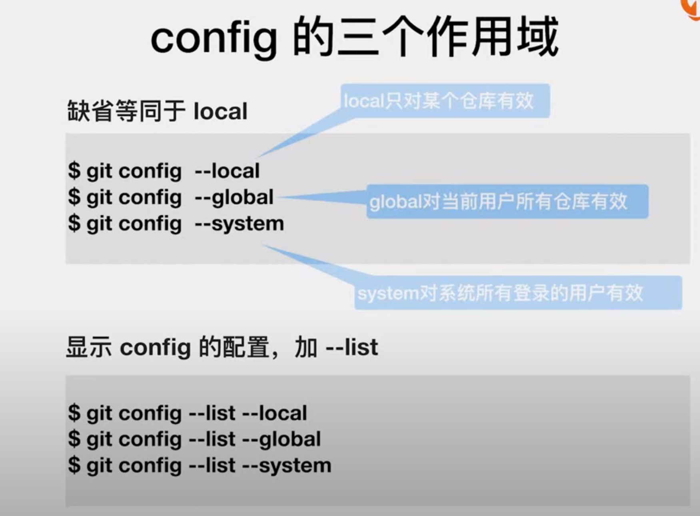

# Git基本命令模块

## 目录

-   [一、git的配置命令](#一git的配置命令)

在ubuntu上如果不需要分页输出内容需要使用：

```bash
git --no-pager xxxx
```

# 一、git的配置命令



> 📌注意：`<branch-name>` 是表示你要推送的本地分支的名称，而 `<remote>` 是表示你要推送到的远程仓库的别名。

[管理本地仓库](管理本地仓库/管理本地仓库.md "管理本地仓库")

[管理远程仓库](管理远程仓库/管理远程仓库.md "管理远程仓库")
