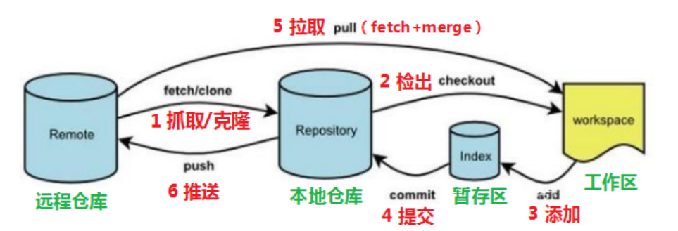
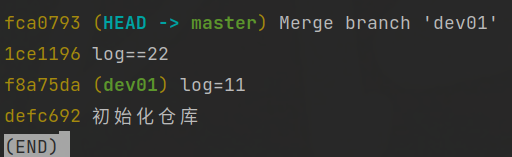
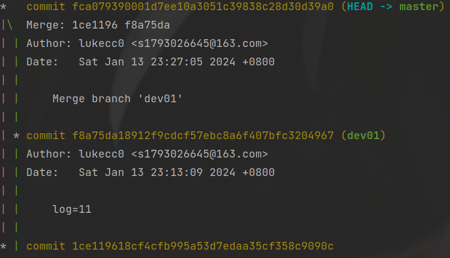
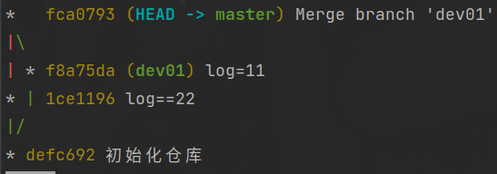
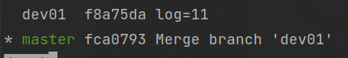
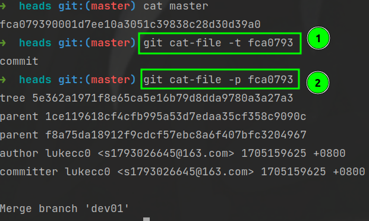

# 管理本地仓库

## 目录

-   [一、仓库管理](#一仓库管理)
    -   [1、创建仓库和初始化](#1创建仓库和初始化)
    -   [2、添加和提交更改](#2添加和提交更改)
    -   [3、查看状态和历史](#3查看状态和历史)
    -   [4、撤销更改](#4撤销更改)
-   [二、分支管理](#二分支管理)
    -   [1、分支管理相关概念](#1分支管理相关概念)
    -   [2、创建与删除](#2创建与删除)
    -   [3、切换与合并](#3切换与合并)
-   [三、通过哈希值查找对象](#三通过哈希值查找对象)
-   [四、变基命令及策略——rebase](#四变基命令及策略rebase)



# 一、仓库管理

## 1、创建仓库和初始化

-   `git init`: 在当前目录创建一个新的 Git 仓库。执行后会在当前目录下生成一个名为 ".git" 的子目录，用于保存仓库的版本历史等信息。
-   `git clone <repository-url>`: 克隆远程仓库到本地。使用这个命令可以在本地创建一个已经存在的远程仓库的副本。

## 2、添加和提交更改

-   `git add <file>`: 将文件添加到暂存区（Staging Area）。使用这个命令可以告诉 Git 将指定文件的更改包含在下一次提交中。
-   `git add .`: 将所有修改过的文件添加到暂存区。使用这个命令可以批量添加所有已修改文件的更改。
-   `git commit -m "Commit message"`: 提交暂存区的文件，并添加提交消息。使用这个命令会将暂存区中的更改永久地保存到版本历史中。

## 3、查看状态和历史

-   `git status`: 显示工作区和暂存区的状态。使用这个命令可以查看当前修改的文件以及暂存区的状态。
-   `git reflog`:显示`commit`的历史提交记录
-   `git log`: 查看提交历史。使用这个命令可以查看仓库中所有提交的历史记录，包括提交的作者、日期、提交消息等信息。
    > 命令形式：git log \[option]
    > options
    > &#x20;     \--all 显示所有分支
    > &#x20;     \--pretty=oneline 将提交信息显示为一行
    >
    > \*\* git log  —oneline\*\*​
    >
    > 
    >
    > &#x20;     \--abbrev-commit 使得输出的commitId更简短
    > &#x20;     \*\* --graph 以图的形式显示 \*\*&#x20;
    >
    > 
    >
    > > 📌**查找命令的组合用法**
    >
    > ```bash
    > git log --all --graph --oneline
    >
    > ```
    >
    > 
-   `git diff`: 查看工作区和暂存区之间的差异。
-   `git diff --staged`: 查看暂存区和最后一次提交之间的差异(HEAD)。又等于`git diff --cached`

## 4、撤销更改

-   `git restore <file> `:**丢弃工作区**的改动，`git restore  . `可以丢弃所有工作区的修改。
-   `git reset HEAD <file>`: 将文件从**暂存区移回工作区**。使用这个命令可以取消暂存文件的更改，但保留在工作区中的更改。
-   `git reset --hard HEAD^`:回到上一个版本
-   `git reset --hard <history-name>`:回到指定名称版本的
-   `git branch -f main HEAD~3 `强制将main分支回到HEAD的上三个commit
-   `git revert <commit>`: 创建一个新的提交，撤销指定提交的更改。使用这个命令可以撤销某次提交的更改而不影响历史记录。
-   如果只是想查看 `分支` 提交的更改，而不是将分支回滚到该提交，可以使用 `git show` 命令

> **注意：**`git reset --hard HEAD~3` 会直接影响当前分支(假设为main)的 HEAD、工作目录和暂存区。
> `git branch -f main HEAD~3` 只是将 `main` 分支指向指定的提交，不影响工作目录和暂存区。

# 二、分支管理

## 1、分支管理相关概念

-   **仅快进（fast-forward）：**

    例如当前有两个分支A、B。此时仅修改B分支，然后切换到A分支使用merge合并B分支。由于A分支并没有做修改，因此该合并模式叫做**快进**

## 2、创建与删除

-   `git branch`: 显示所有本地分支。使用这个命令可以查看当前仓库中存在的所有分支，并标识出当前所在的分支。
-   `git branch -v` : 查看分支的和分支相关练习

    
-   `git branch -vv` : 查看远程分支与本地分支的关系。
-   `git branch <branch-name>`: 创建新的分支。使用这个命令可以在当前的提交上创建一个新的分支。
-   `git checkout --orphan <new_branch>`：创建一个没有提交记录的新分支。
-   `git checkout -b 本地分支名 origin/main`：建一个新的本地分支，并将其跟踪远程的 `main` 分支
-   给a分支创建一个子分支

```bash
# 创建并切换到新的子分支 sub-branch，基于分支 a
git checkout -b sub-branch a
```

-   `git branch -d <branch-name>`：删除指定名称的分支，需要做检查。
-   `git branch -D <branch-name>`：删除指定名称的分支，强制删除不需要检查。
-   `git branch -M main`: 修改当前分支名为main。

## 3、切换与合并

-   `git checkout <branch-name>`: 切换到指定分支。使用这个命令可以在已有分支之间切换。
-   `git checkout -b <branch-name>`：创建一个新的分支并且切换到该分支。
-   `git merge <branch-name>`: **将指定分支合并到当前分支**。使用这个命令可以将指定分支的更改合并到当前所在的分支。
-   `git switch -` ：撤销此操作，**切换到上一个分支**

# 三、通过哈希值查找对象

1.  **`git cat-file -t <object>`：**
    -   **作用：** 显示指定Git对象的类型。
    -   **用法：** `git cat-file -t <object>`
    -   **示例：** `git cat-file -t abc123`（其中`abc123`是对象的SHA-1哈希值）
    -   **输出：** 返回对象的类型，例如 `commit`、`tree`、`blob`等。
2.  **`git cat-file -p <object>`：**
    -   **作用：** 显示指定Git对象的内容。
    -   **用法：** `git cat-file -p <object>`
    -   **示例：** `git cat-file -p abc123`（其中`abc123`是对象的SHA-1哈希值）
    -   **输出：** 返回对象的实际内容。对于提交对象，这可能包括作者、日期、提交消息等；对于树对象，它会列出树中包含的文件和子树；对于blob对象，它会显示文件的内容。



# 四、变基命令及策略——rebase

> 📌注意：选择需要变基分支的**父分支**

命令：

-   `git rebase -i `：可交互式变基，执行该命令后主动编写变基策略
-   `git rebase --continue`：继续执行被暂停 rebase 进程
    -   这个情况发生于出现冲突时，需要先手动解决冲突`git add`，然后再执行`git rebase --continue`继续刚刚的变基操作。
-   `git rebase --skip`：跳过当前的提交，这将从 rebase 中删除当前的提交，然后继续应用余下的提交。
-   `git rebase --abort`：放弃基变操作，回到初始状态

策略：

-   `p, pick` <提交> = 使用提交
-   `r, reword`` `<提交> = 使用提交，**但编辑提交说明，用于修改commit的说明**
-   `e, edit` <提交> = 使用提交，但停止以便在 shell 中修补提交
-   `s, squash` <提交> = 使用提交，但**挤压到前一个提交，将多个commit合并**
-   `f, fixup` \[-C | -c] <提交> = 类似于 "squash"，但只保留前一个提交的提交说明，除非使用了 -C 参  数，此情况下则只保留本提交说明。使用 -c 和 -C 类似，但会打开
-   `x, exec` <命令> = 使用 shell 运行命令（此行剩余部分）
-   `b, break` = 在此处停止（使用 'git rebase --continue' 继续变基）
-   `d, drop` <提交> = 删除提交
