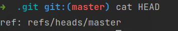
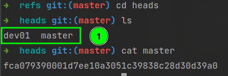
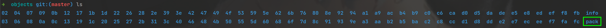
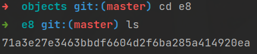
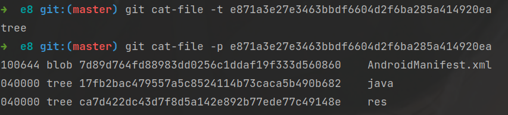
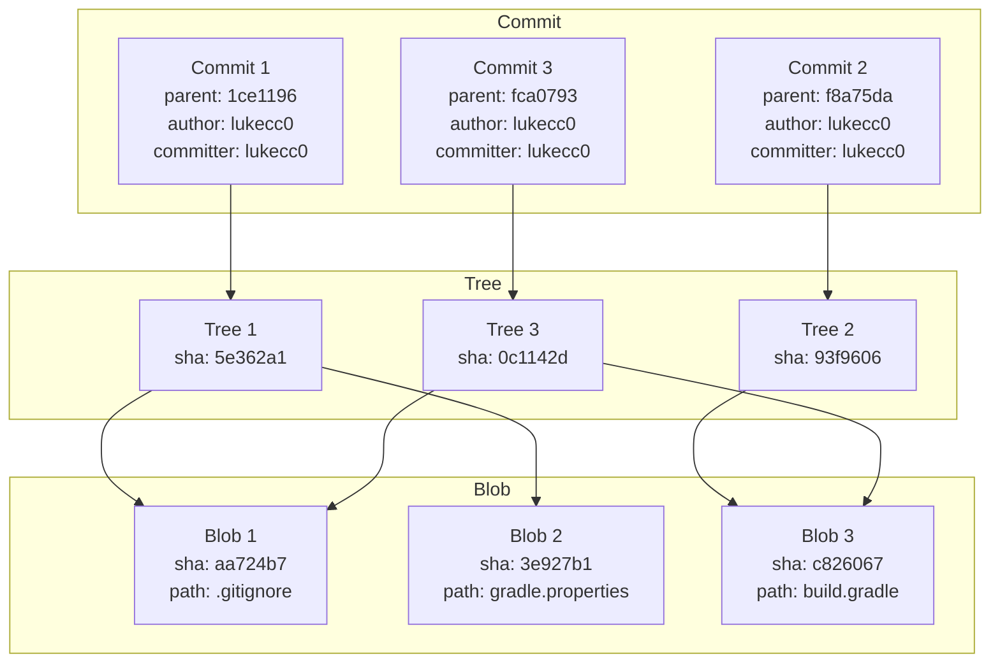
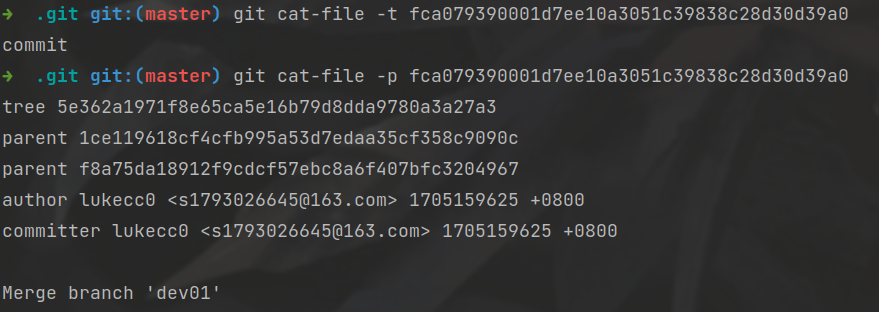
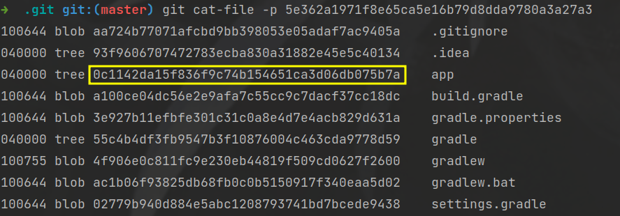

# Git的使用及原理

## 目录

-   [一、Git的目录](#一Git的目录)
    -   [1、HEAD](#1HEAD)
    -   [2、refs](#2refs)
    -   [3、object](#3object)
-   [二、Commit、Blob、Tree三个对象的关系](#二CommitBlobTree三个对象的关系)

# 一、Git的目录

首先我们了解一下git目录的文件都有什么作用：

1.  **branches：**
    -   存储分支的信息，每个分支通常是一个文件。
2.  **COMMIT\_EDITMSG：**
    -   包含当前提交（commit）的编辑消息。
3.  **config：**
    -   存储Git仓库的配置信息，例如用户名、邮箱等。
4.  **description：**
    -   仅用于显示给人类，一般包含仓库的描述信息。
5.  **HEAD：**
    -   指向当前所在的分支或提交。
6.  **hooks：**
    -   包含客户端或服务器端的钩子脚本，这些脚本可以在特定事件触发时执行。
7.  **index：**
    -   存储暂存区（staging area）的内容，即即将提交的文件列表和它们的状态。
8.  **info：**
    -   包含仓库的一些额外信息。
9.  **logs：**
    -   包含一些日志文件，记录了各种引用的更新历史。
10. **objects：**
    -   存储所有的Git对象，包括提交、树对象、和文件快照。
11. **ORIG\_HEAD：**
    -   记录上一次执行某些操作（如合并）前的HEAD位置。
12. **refs：**
    -   存储引用（references），包括分支和标签。

## 1、HEAD

在git的目录中HEAD**充当一个指针**，它**指向了当前分支的位置**，我们查看HEAD即可发现，当前master分支位于`refs/heads`目录下。

## 2、refs

refs目录下有两个文件heads、tags：

1.  **heads目录：**
    -   存储本地分支的引用。每个本地分支都会在`heads`目录下有一个相应的文件，文件名与分支名一致。**这些文件包含了分支引用的SHA-1哈希值**。
        
2.  **tags目录：**
    -   存储标签的引用。每个标签都会在`tags`目录下有一个相应的文件，文件名与标签名一致。这些文件包含了标签引用的SHA-1哈希值，指向被标记的提交。
        例如，如果你有一个名为`v1.0`的标签，那么在`.git/refs/tags/`目录下就会有一个名为`v1.0`的文件，其中包含`v1.0`标签的当前引用的SHA-1哈希值。

## 3、object

在 `.git/objects` 目录下，Git 存储了所有的对象，包括**提交、树对象、文件快照**等。这个目录的结构是由 Git 使用的一种对象存储方式所定义的。

-   **子目录 (Directories):** 该目录下的子目录是**以对象哈希值的前两个字符为名**的，每个子目录中包含了以这两个字符开头的对象。`这种设计有助于提高文件系统的性能，因为大量的对象可以分散存储在不同的子目录中。`
-   **对象文件 (Object Files):** 在这些子目录下，你会看到一系列以 40 个字符的十六进制数命名的文件，这是对象的 SHA-1 哈希值。这些文件实际上是 Git 对象的内容。

    
    -   **Blob 对象 (文件):** 存储文件的内容。
    -   **Tree 对象 (目录结构):** 存储目录和文件的布局信息。
    -   **Commit 对象 (提交信息):** 存储提交的元数据和指向树对象的**引用。**
-   **info 目录:** 包含了一些仓库的额外信息。
-   **pack 目录:** 包含了打包的对象文件，Git 使用这种方式来优化存储空间和提高性能。

我们尝试查看e8文件的哈希值对应了什么东西：[管理本地仓库](../Git基本命令模块/管理本地仓库/管理本地仓库.md "管理本地仓库")

# 二、Commit、Blob、Tree三个对象的关系

我们找一个commit查看一下，发现这个commit其中也包含了一个tree。

值得一提的是这个commit的parent也是一个commit，**从结构上来看commit是一个链式结构**。

> \*\*commit的结构解析: \*\*
>
> 每个 `commit` 包含一个或多个父提交的引用。这形成了一个提交历史的有向无环图（DAG），**其中每个节点是一个提交，每条边表示一个父子关系**。

接下来我们再从commit中找一个tree看一下。

发现里面有tree是一个树形结构，这个结构可以**层次表示目录和文件、支持快速检索和比较**。

这里面的每一个Blob就是对应的具体文件内容，在这里git做了一个非常好的操作，这是Blob不是根据文件名判断是否为一个对象，**而是根据内容来判断是否为同一个对象**。

> eg：
>
> 就是有两个文件名为a，b的文件，它们的内容都是Hello World！这时git就会把它们做成同一个Blob。
