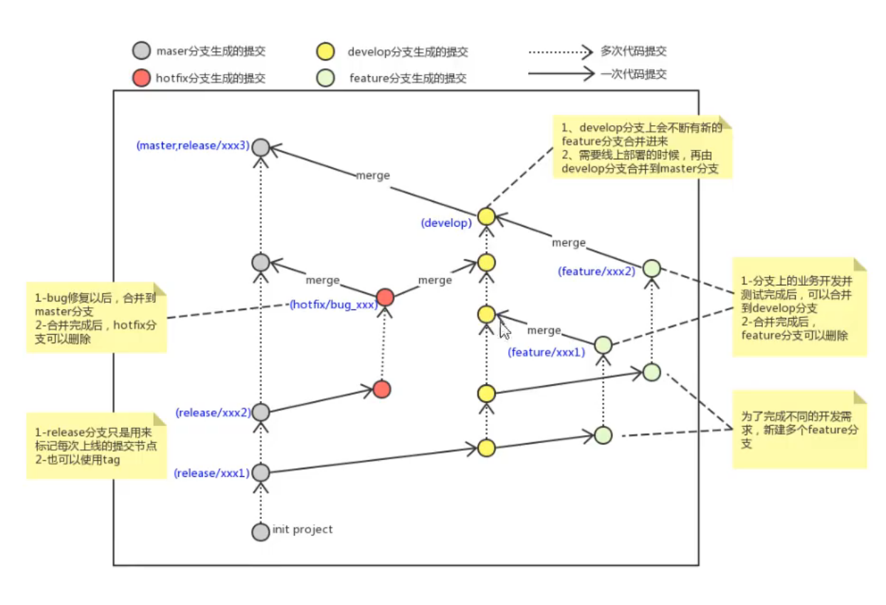

# 分支命名规范与原则

在开发中，一般有如下分支使用原则与流程：
**·master(生产)分支**

> &#x20;线上分支，主分支，中小规模项目作为线上运行的应用对应的分支

**·develop(开发)分支**

> &#x20;是从master创建的分支，一般作为开发部门的主要开发分支，如果没有其他并行开发不同期上线要求，都可以在此版本进行开发，阶段开发完成后，需要是合并到master分支，准备上线。

> **·feature/xxxx分支**
> 从develop创建的分支，一般是同期并行开发，但不同期上线时创建的分支，分支上的研发任务完成后合并到develop分支。

> 📌 **·hotfix/,XxXx分支，**
> 从master派生的分支，一般作为线上bug修复使用，修复完成后需要合并到master、test、develop:分支。

·还有一些其他分支，在此不再详述，例如test分支（用于代码测试）、pre分支（预上线分支）等等。

**企业分支管理流程图：**

