# 解决分支版本出现的问题

## 目录

-   [1、版本冲突出现的原因](#1版本冲突出现的原因)
-   [2、分离头指针](#2分离头指针)
-   [3、修改commit的message](#3修改commit的message)
-   [4、合并多个commit](#4合并多个commit)
-   [5、相同文件紧急加塞——stash](#5相同文件紧急加塞stash)
-   [6、拒绝合并无关历史](#6拒绝合并无关历史)
-   [7、多人修改相同文件](#7多人修改相同文件)

## 1、版本冲突出现的原因

如果出现两个不同版本对同一个地方做出修改操作，那么就会造成版本冲突：

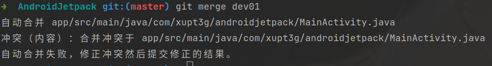

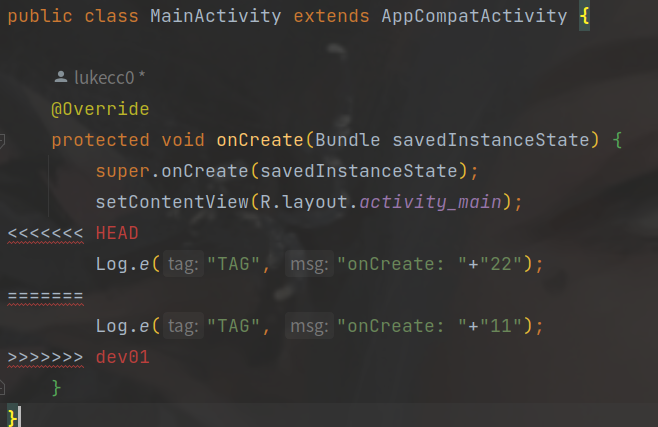

此时git就会将冲突部分显示出来，交由工作者处理，处理完成后运行`git commit` 命令即可。

-   **解决冲突的步骤：**

    1.处理文件中冲突的地方
    2.将解决完冲突的文件加入暂存区([管理本地仓库](../Git基本命令模块/管理本地仓库/管理本地仓库.md "管理本地仓库"))
    3.提交到仓库()

## 2、分离头指针

什么是分离头指针，简单来说就是此时HEAD指向了一个commit，并没有通过分支关联这个commit。

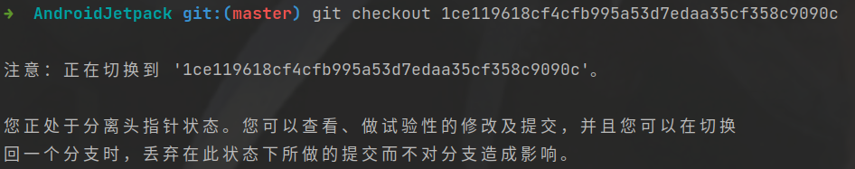

可以在分离头指针的情况下对某一个git版本进行修改，这种修改可以从分支中独立出来。

`git switch -c <新分支名>`： 创建分支来保留在此状态下所做的提交

`git switch -` ：撤销此操作，切换到上一个分支

## 3、修改commit的message

使用变基策略修改message，首先寻找到当前分支的父分支。

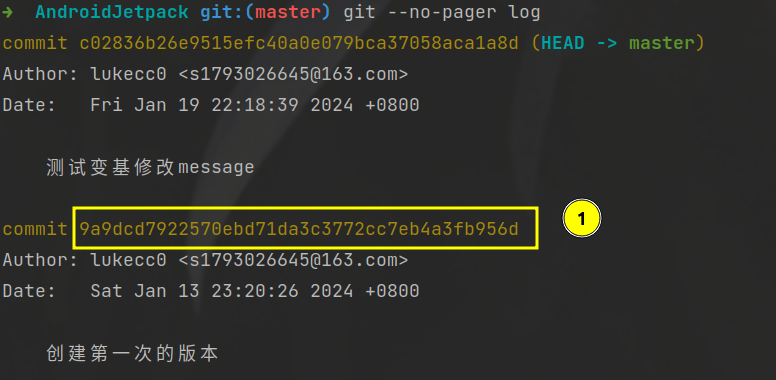

使用变基命令操作该父分支即可：

```bash
git rebase -i 9a9dcd7922570ebd71da3c3772cc7eb4a3fb956d

```


值得一提的时这里使用到了一个`分离头指针`的操作，根据[Git的使用及原理](../Git的使用及原理/Git的使用及原理.md "Git的使用及原理")可以知道我们在这个过程中使用新的指针重写了message但是这个父指针中的Blob都是没有发生变化的。

## 4、合并多个commit

同样的寻找的需要合并的分支最先开始的父分支，例如需要合并以下分支，那么我们需要找到这个父分支，也就是这个编号1。

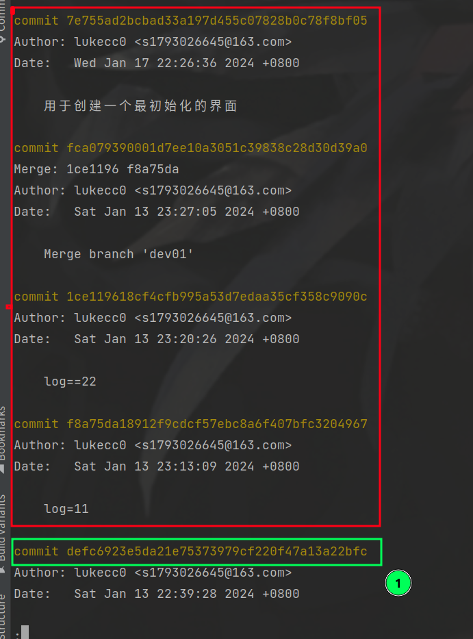

执行这个命令：

```bash
git rebase -i defc6923e5da21e75373979cf220f47a13a22bfc
```

此时来到这个页面，然后我们通过[管理本地仓库](../Git基本命令模块/管理本地仓库/管理本地仓库.md "管理本地仓库")完成合并即可。

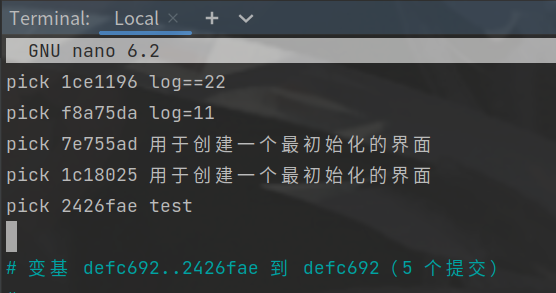

合并以后出现这样的问题，我们根据提示解决即可。这种问题就是出现冲突了，需要手动解决冲突。

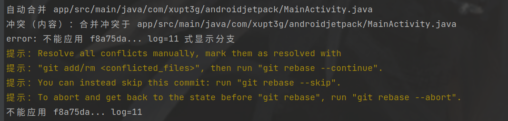

> 📌这里我们有时候需要注意一个问题，当我们需要合并最古老的分支时，这个分支没有父分支，此时我们选择这个最古老的分支进行变基，手动在变基策略上加上这个最古老分支。

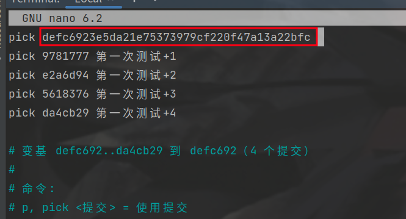

刚刚我们合并了连续的commit，**那怎么合并不连续的commit？** 很简单修改变基策略即可：

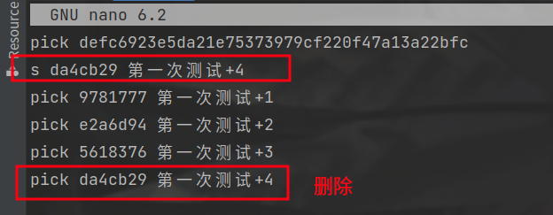

## 5、相同文件紧急加塞——stash

例如：当前我们 正在为a文件添加新的功能，但是运行版本的a文件出现bug、我们需要紧急修改a文件的bug，然后再进行新功能的添加，此时我们应该怎么做？

我们可以将当前文件使用`git stash `进行保存，然后回自动回到未添加功能的版本，此时将这个bug进行修复。

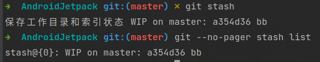

修复完成以后使用`git stash pop` 或者 `git stash apply`将刚刚保存的版本进行继续添加功能。

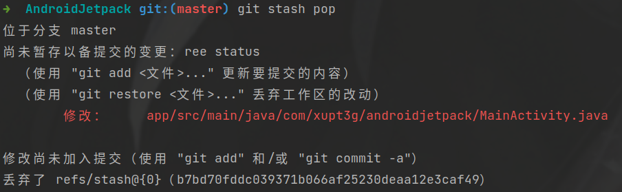

## 6、拒绝合并无关历史

为什么出现这种问题？因为远程分支和本地分支没有相关联系，分别是两个独立的树。

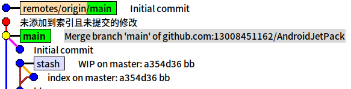

一种解决方法是使用 `--allow-unrelated-histories` 选项，允许合并两个没有共同祖先的分支。

你可以按照以下步骤执行：

```bash
# 拉取 master 分支的变更，并允许合并无关的历史
git pull origin master --allow-unrelated-histories origin/master
```

在这里，从远程仓库 `origin` 的 `master` 分支拉取变更，使用 `--allow-unrelated-histories` 允许合并无关的历史，最后进行合并。

请注意，在合并两个没有共同祖先的分支时，你可能需要解决合并冲突。Git 会自动尝试合并，但如果存在冲突，你需要手动解决冲突并完成合并。在解决冲突后，使用 `git add` 添加修改，然后执行 `git merge --continue` 完成合并。

```bash
# 解决冲突后，执行以下命令继续合并
git add .
git merge --continue
```

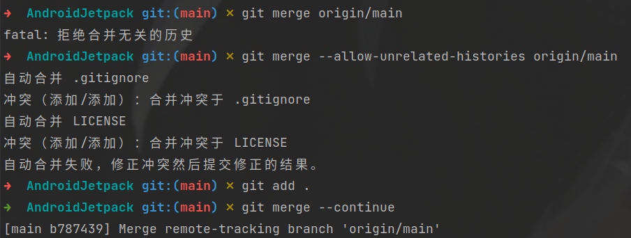

接下来我们观察这个结构树发现main分支有两个父节点：

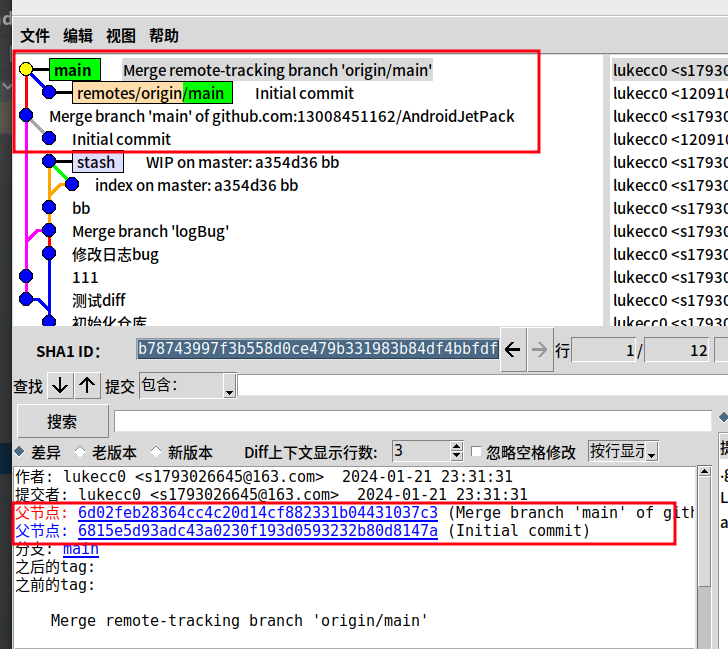

## 7、多人修改相同文件

有时候会遇到多个人修改相同的文件，多方对这个文件都有提交。像这样本地多一个commit，比远程少一个commit。

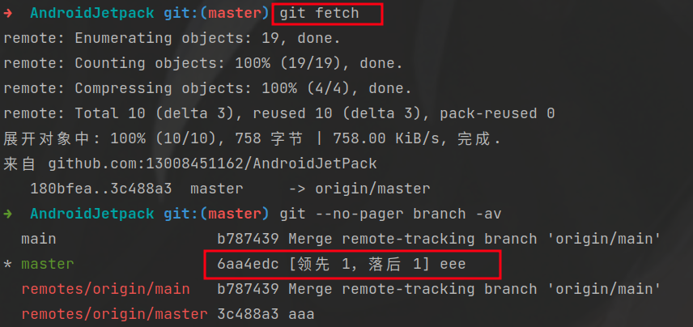

此时我们可以使用：`git merge /origin/master `直接合并远程分支，当然也可以使用`git pull `拉取并且自动合并。
